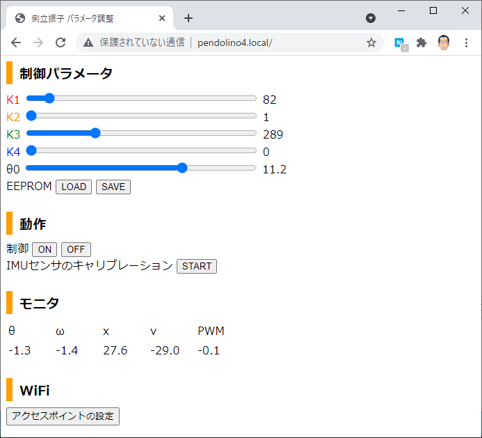

# ESP32で作る倒立振子

[前面拡大](images/front.jpg) / [背面拡大](images/back.jpg)

## メカ
タミヤの「楽しい工作シリーズ」の部品を使用します。
[「半日で作る倒立振子」](https://www.instructables.com/%E5%8D%8A%E6%97%A5%E3%81%A7%E4%BD%9C%E3%82%8B%E5%80%92%E7%AB%8B%E6%8C%AF%E5%AD%90/)を参考にしました。
- ユニバーサルプレート
- ダブルギヤボックス（ギア比は114.7：1）
- スリムタイヤセットの大径ホイール

## 回路
ALGYAN 6th IoT基板を使用します。 他のESP32搭載ボードも同等の回路構成にすれば利用できます。

- [ALGYAN 6th IoT基板](https://github.com/algyan/algyan_6th/) (ESP32)
- [DRV8533モータドライバモジュール](https://akizukidenshi.com/catalog/g/gK-09848/)
- [M5Stack用6軸IMUユニット](https://www.switch-science.com/catalog/6623/)
- NiMH単三バッテリー × 4セル (4.8V)
- 電源はCN9から供給し SJ3 にショットキーバリアダイオードを挿入 (USBとの電源衝突対策)

## ソフトウェア
- ESP32のソフトウェアはArduinoベース (説明省略)
- 依存ライブラリ: [arduinoWebSockets](https://github.com/Links2004/arduinoWebSockets)
- 設定画面のHTMLソースはSPIFFSのアップローダでESP32の内蔵Flashに保存 (説明省略)

## 動作
- SW3を押しながら電源ONまたはリセットするとWiFiはAPモードで起動します。そうでなければSTAモードで起動します。
- ただし接続するAPが未設定の場合は必ずAPモードで起動します。接続するAPは後述の設定画面で設定します。
- STAモードの場合、APに未接続の間はLED3が点滅します。APに接続すると消灯します。
- ブラウザからアクセスがあったときLED3が点灯します。
- 起動時には倒立振子の制御は待機状態になっています。このときLED2は点滅します。
- 倒立振子をバランスする姿勢に立たせると制御を開始します。このときLED2が点灯します。
- ただし初期状態では制御パラメータが全てゼロなのでモータは動きません。後述の設定画面でパラメータを調整します。
- SW2を押すと制御のON⇔OFFをトグルします。制御OFFのときLED2は消灯します。
- SW3を押すとIMUセンサのキャリブレーションを開始します。キャリブレーション中はLED1が点灯します。
- キャリブレーションは制御をOFFにして静置した状態でおこなってください。
- SW1はリセットボタンです。

## Webブラウザからの設定
- 最初はAPモードで起動します。
- SSIDは esp32-xxxxxx (xxxxxxの部分はボード固有), パスワードは 12345678 です。  
- PCからこのAPに接続すると設定画面がブラウザで開きます。
- STAモードを利用したい場合は、「アクセスポイントの設定」をクリックして、接続するAPのSSIDとパスワードを設定します。
- STAモードで起動した場合、http://pendolino4.local/ にアクセスして設定画面を開きます。
- このページで制御パラメータ θ0, K1, K2, K3, K4 を調整します。

## パラメータ調整の手順
まず、制御をOFFにした状態でIMUセンサのキャリブレーションを行います。

次に倒立振子を指で支えて立たせ、ちょうどバランスするときのθの値を設定画面で読み取ります。この値をθ0に設定します。

そして、制御ゲインK1～K4を以下の手順で調整します。

1. まずすべてのゲインをゼロにする。出力はゼロになる。
2. 角度ゲインK1を上げると、倒れた姿勢を立て直すトルクを生じ、やがて行き過ぎて往復運動(発振)するようになる。
3. 角速度ゲインK2を上げると発振が収まる。
4. 2～3を繰り返し、指一本で軽く触れるだけで安定し、指を動かすとついてくるように調整。
5. 位置ゲインK3を上げると、指で引いたときに反対向きに倒れて抵抗する。指をはなすと行き過ぎて発振する。
6. 速度ゲインK4を上げると、位置の発振が収束して自立する。
7. ゲインを上げすぎるとノイズなどに過敏になり不安定になる。

【参考文献】  
熊谷正朗 「車輪移動型倒立振子の開発にみるセンサの使い方」 (デザインウェーブマガジン 2007年8月号)               

## ファイル一覧
- [Pendolino4/](Pendolino4/) : ESP32用Arduinoスケッチ
- [Pendolino4/data](Pendolino4/data) : 設定画面のHTMLソース

## 発表資料
NOW PRINTING

## 過去の関連作品
- Pendolino1 (GR-KURUMIボード使用) → [資料](https://www.slideshare.net/lipoyang/grkurumi-37408753), [動画](https://www.youtube.com/watch?v=4Dj65RKEbd0)
- Pendolino2 (GPduino-BLEボード使用) → [ソース](https://github.com/lipoyang/Pendolino)
- Pendolino3 (GPduino-WiFiボード使用) → [ソース](https://github.com/lipoyang/Pendolino)
